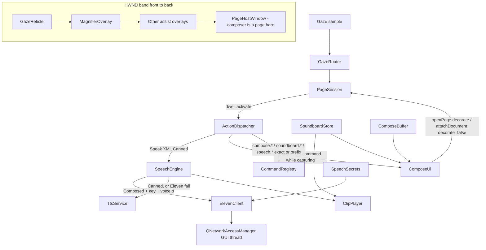
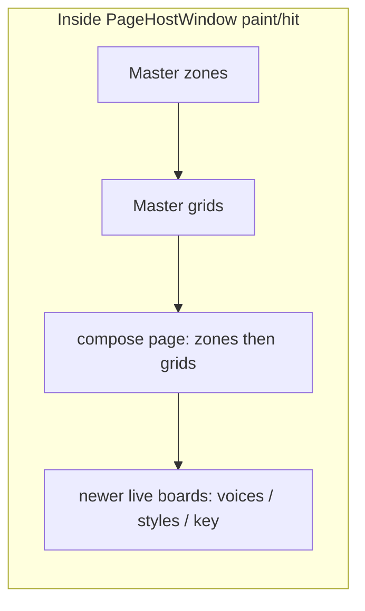
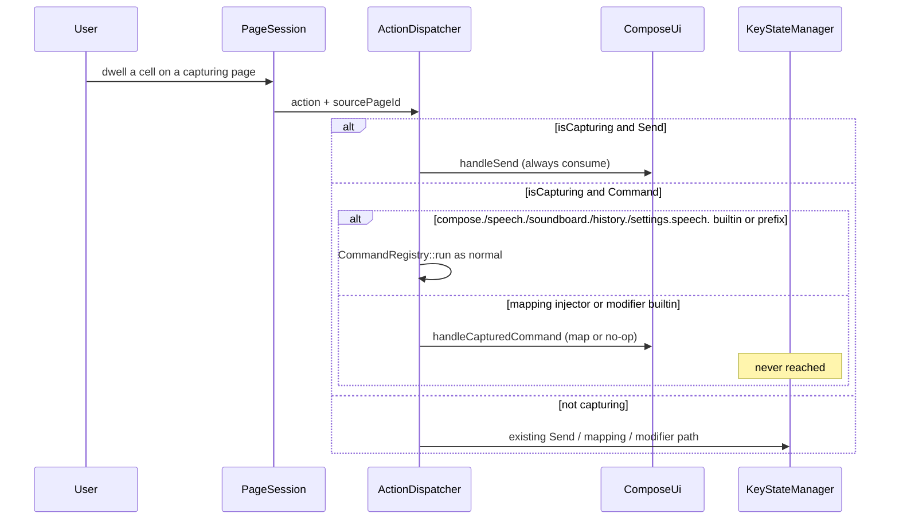
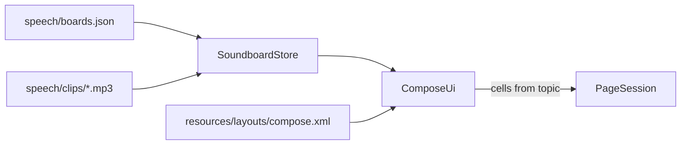

# Gaze-first speech composer, ElevenLabs, and soundboard

Historical v1 spec (2026-09-03). Live behavior is `src/app/Commands.md`, `src/app/ComposeUi.h`, `src/assist/SpeechEngine.h`, and shipped `resources/layouts/compose.xml`. Several claims below are stale (`TtsService::finished`, prefix `CommandRegistry`, settings hub, CMake Network/Multimedia).

| Field | Value |
|-------|--------|
| **Status** | Historical (implemented; do not treat as current API) |
| **Author** | Gazer design |
| **Date** | 2026-09-03 |
| **Audience** | Gazer engineers (C++20 / Qt 6) |
| **Related** | Voice web app at `C:\Users\adamr\source\repos\Voice` (UX prior art, not a stack to port) |

---

## Overview

Gazer today can speak a canned XML `Speak` string through Windows SAPI (`TtsService` via `SpeechEngine`). Speak is audio only; it never types into the focused OS app. It cannot compose a phrase internally, switch cloud voices, insert ElevenLabs v3 audio tags, or pin a generated clip onto a dwellable soundboard. The Voice web app already has that product loop: compose → speak (Eleven / Piper / browser) → pin baked audio onto a topic grid → replay without re-synthesis.

This design ports **Voice’s product loop** onto **Gazer’s gaze architecture**: one frameless `QQuickWindow` (`PageHostWindow`), boards as Page XML, dwell cells, no new HWND. ElevenLabs is the cloud engine **for the composer**. SAPI remains the engine for canned XML `<Speak>` / `gazer.speak()`, and the per-utterance fallback when an Eleven request fails. Piper and browser `SpeechSynthesis` are out of v1.

The implementation adds a **composer page** (internal phrase buffer + a **stripped** dwellable keyboard that never injects to the OS), **voice and style live boards** (each with on-board gaze chrome; no buried-keyboard search), a **JSON soundboard store** bound onto a template page (not rewritten XML), and an async **speech engine** (`SpeechEngine`). `QNetworkAccessManager` and `QMediaPlayer` stay on the GUI thread; the gaze sample path only queues work.

---

## Background & Motivation

### Current Gazer speech path

```
Page XML <Speak value="Hello"/>
  → ActionDispatcher::dispatchPage (PageActionType::Speak)
  → SpeechEngine::speak (Canned)
       → TtsService::speak  (ISpVoice, SPF_ASYNC | SPF_PURGEBEFORESPEAK)
```

Relevant code:

- `src/assist/TtsService.{h,cpp}` — SAPI only; `stop()` purges; signals `started` / `failed` only (**no `finished`**).
- `src/app/ActionDispatcher.cpp` case `PageActionType::Speak` → `SpeechEngine` Canned.
- `src/assist/ScriptHost.cpp` `ScriptApi::speak` → `SpeechEngine` Canned.
- Mapping names `clearPhrase` / `speakPhrase` in `resources/mappings/default.json` are **not** builtins. They inject `Ctrl+A, Backspace` and `Ctrl+Enter` into the focused OS app. They are unrelated to any Gazer phrase buffer.
- `CommandRegistry::run` is exact `QHash` lookup (`src/app/CommandRegistry.cpp`). Unregistered names fall through to the mapping profile. Settings “star” commands work because `SettingsCommands.cpp` **pre-registers each finite name**.
- `leftShift` / `leftCtrl` / `leftAlt` / `leftWin` are Gazer builtins in `GazerServices.cpp` that **cycle OS modifiers**. `backspace` / `space` / `enter` / `escape` / `tab` / arrows are mapping injectors.
- `Application::shutdownUi` calls `tts().stop()` only.

Keyboard pages (`resources/layouts/qwerty_main.xml`, `uw_qwerty.xml`) `Send` keys through `KeyStateManager` into the OS. `qwerty_main` grid `board` is **not** Send-only: it also dwells those modifier and mapping commands. There is no internal compose buffer.

### Pain points

1. AAC users who speak with their eyes need a **message they can edit before speaking**, not only canned `Speak` cells or OS-focused typing.
2. SAPI voices are limited; ElevenLabs v3 audio tags (`[laugh]`, `[english accent]`) are the style system users already know from Voice.
3. Re-synthesizing a frequent phrase on every dwell is slow (hundreds of ms to seconds) and costs quota. Voice’s soundboard stores **baked MPEG** and plays it locally.
4. API key, voice catalog, and last-used voice must be gaze-editable and local. Gazer settings are already gaze boards (`SettingsUi*`), not desktop dialogs.

### What to take from Voice (spirit, not stack)

From `Voice/index.html`, `js/compose.js`, `js/eleven.js`, `js/speech-engines.js`, `js/voices.js`, `js/eleven-key.js`, `js/topics.js`, `js/board-io.js`, `js/speech-playback.js`:

| Voice behavior | Gazer equivalent |
|----------------|------------------|
| Compose field + word chips + undo/redo | `ComposeBuffer` + chip grid on a dwell page |
| Bracket tags `[laugh]`, saved-tag chips | Tag insert live board; tags force Eleven v3 |
| Speak / stop / regenerate / pin | **One** Speak cell; decorate label/icon from engine status |
| Searchable voice panel, last voice persisted | Paginated voice board (favorites + 12/page); last voice in settings |
| Model v3 vs Flash, speed split 0.7–1.2 | Style board; `splitSpeed` including Voice’s 0.25–4 clamp |
| Topics with baked `audioData` | JSON store + on-disk MP3; cells play files |
| Create vs overwrite modal | Assign mode: dwell empty = create, dwell occupied = overwrite |
| History of generations | Capped on-disk history board |
| API key local, never logged | DPAPI blob; **on-board** gaze keyboard to enter |
| Offline fallback | Per-utterance SAPI fallback on network error; clips still play from disk |

Do **not** port Piper WASM, browser TTS as a first-class engine, Voice’s chat-slot chrome, Icon Studio, or `audioData` data-URLs in JSON.

---

## Goals & Non-Goals

### Goals (v1)

- Dwellable composer: internal phrase, word-level delete, undo/redo, insert `[tags]`, speak, stop, regenerate, clear, pin-to-soundboard.
- Fast voice switch: cached ElevenLabs catalog, language/gender chips, favorites, **paginated remainder (12/page)**, persist last voice + model. No free-text search in v1.
- Fast style switch: model (v3 / Flash v2.5), saved tag chips, speed (Voice `splitSpeed` policy).
- Soundboard: topic grids (v1 cap 4×6); dwell plays baked MP3 when present, else live-speaks `utteranceText`; assign mode after compose.
- Existing `<Speak>` / `gazer.speak` keep working **as SAPI** (no Eleven quota on every board cell). Composer Speak uses Eleven when configured.
- Per-utterance SAPI fallback when Eleven fails; clips on disk still play; no network on the gaze/paint path.
- Gaze latency: generation never blocks `PageHostWindow` paint or hit-test; in-progress shown on the Speak cell.
- Live z-order unchanged: no second HWND for composer chrome.

### Non-goals (v1)

- Piper, browser `SpeechSynthesis`, or a pluggable engine registry beyond `{eleven, sapi}`.
- Independent pitch DSP / Voice `audio-fx.js` WSOLA bake. Speed remainder uses `QMediaPlayer::setPlaybackRate(localSpeed)`; pitch is persisted and ignored in v1.
- Mutating shipped Page XML as the soundboard source of truth.
- Qt Widgets composer, `PreviewWindow`-style extra top-level window, or a second `PageHostWindow`.
- Import/export of Voice `aac-workspace` JSON with embedded data-URLs (optional later; Gazer-native file export is a stretch).
- Per-clip output-device picker (system default speaker).
- Multi-chat slots (Voice mobile header chips).
- Changing `clearPhrase` / `speakPhrase` mapping semantics (they stay OS injectors).
- Free-text voice search; cloning `qwerty_main.xml` wholesale onto the composer.
- Routing canned XML `Speak` through Eleven.

---

## Key Decisions

Product choices below that say **User confirmed 2026-09-03** match this document’s recommended defaults and are final.

| Decision | Choice | Rationale |
|----------|--------|-----------|
| Soundboard persistence | **JSON store + on-disk clips + template page, live-rebuilt grid** | Pages are XML; cells have static actions. `SettingsUi::presentLive` / `PageSession::attachDocument` already rebuild in-memory documents. Rewriting XML fights `PageCatalog`, the editor, and user copies under `%AppData%\Gazer\layouts`. |
| Composer keyboard | **Stripped keyboard on `compose.xml`** (letters, digits, space, backspace, enter, local `compose.shift`, `[` `]`, `'` `,` `.`). **While `isCapturing(sourcePageId)`, intercept every `Send` and every mapping/modifier command. Unlisted keys are no-ops, never OS fallthrough.** | Cloning `qwerty_main` would still fire `leftShift` (OS modifier cycle), `escape`, `tab`, arrows, etc. AAC cannot leak injectors into the focused app. |
| Live-board text entry | **Each live board that needs text owns its own keys** (hex-pad pattern). Capture includes `settings_eleven_key_live`. Hardware `keyPressed` is extra, not a substitute. | Newest attached page is opaque; buried `compose` keys are not hittable. |
| Voice catalog UX | **Favorites (max 12) + language/gender chips + paginated remainder (12/page, `speech.voiceList.next` / `.prev`).** No free-text search in v1. Pagination names must **not** be a string prefix of `speech.voice.`. | Boards do not scroll. `/v1/voices` is tens to 100+ entries. `speech.voices.next` would be eaten by prefix `speech.voice.` if the exact builtin were missing. |
| Parameterized commands | **`CommandRegistry::registerPrefix`**. Exact match first, then longest registered prefix, then mapping. | Voice ids and button ids are unbounded. Today’s `QHash` exact lookup would fall through to mapping and no-op. |
| Canned vs composer engine | **XML `<Speak>` and `gazer.speak` always SAPI in v1.** Composer Speak (and soundboard live `utteranceText`) use Eleven when model+key+voiceId are set. | Avoids quota and latency on every existing board cell the moment a key is saved. |
| Speak typing | **Never.** Speak is audio only. | AAC must not inject the utterance into the focused app. |
| Offline | **Do not pre-resolve “offline”.** Attempt Eleven when configured; on network/timeout error, SAPI-fallback **that utterance**. Latch three consecutive failures → SAPI for the session (notify once). | No reachability API in-tree; airplane vs DNS vs 401 are different. |
| Speak vs Stop chrome | **One Speak cell.** `ComposeUi::decoratePage` stamps label/icon from `SpeechEngine::status()`. Do not use dotted `visibleWhen`. | `evalVisibleWhen` only accepts `[A-Za-z0-9_]`; dotted keys are invalid → always visible. |
| SAPI completion | **`TtsService` gains `finished()`** in the SpeechEngine PR, before compose chrome. Prefer `SetNotifySink` / `SetNotifyWindowMessage` on the GUI thread; poll fallback is `SPVOICESTATUS.dwRunningState == SPRS_DONE`. Purge/`stop()` emits `finished()` immediately. `Application::shutdownUi` calls `SpeechEngine::stop()`. | Today only `started`/`failed`. Without `finished`, `compose.speaking` never clears on SAPI. |
| NAM / player thread | **GUI thread.** Gaze path starts work with `QMetaObject::invokeMethod(..., Qt::QueuedConnection)` on the GUI object. Do not move `QNetworkAccessManager` or `QMediaPlayer` to a worker. | Qt requires both on the thread that created them. |
| Engines | **ElevenLabs + SAPI.** Piper out of v1. **User confirmed 2026-09-03.** | Gazer already has SAPI. Voice’s Piper path is WASM-specific. |
| Façade | **`SpeechEngine::speak(phrase, SpeakKind, recordHistory)`.** Canned for XML `<Speak>` / `gazer.speak`. Composed for composer/soundboard. `TtsService` remains the SAPI backend. | One speak entry; no type-through. |
| New PageAction types | **None for v1.** Composer / soundboard / voice use `Command` builtins **plus prefix handlers**. | Avoids `PageActionParse` / editor / round-trip work. |
| HTTP | **`QNetworkAccessManager` (Qt Network) on the GUI thread.** | Already in the Qt 6 install; no extra HTTP library. |
| MPEG playback | **Qt Multimedia `QMediaPlayer` + `QAudioOutput` on the GUI thread**, files on disk. If the player is unavailable, live speak falls back to SAPI; the MP3 is still written for later. | ElevenLabs returns `audio/mpeg`. `PlaySound` cannot play MP3. |
| Speed remainder / pitch | **Flash: send API speed (0.7–1.2). Apply `QMediaPlayer::setPlaybackRate(localSpeed)` for the remainder. Persist `speechPitch`; do not apply pitch in v1.** **User confirmed 2026-09-03.** | Voice bakes pitch in Web Audio; Gazer has no WSOLA path in v1. |
| API key | **DPAPI (`CryptProtectData`) in `%AppData%/Gazer/secrets/eleven.dpapi`.** `elevenApiKeySet` is derived from `SpeechSecrets::hasKey()` at load (file wins). Never log the key. **User confirmed 2026-09-03.** | Settings JSON is plaintext. |
| Soundboard v1 grid | **Per-topic `gridCols` / `gridRows` in JSON, clamped 4×6. No gaze cols +/− editor.** **User confirmed 2026-09-03.** | 8×12 rows are too short for gaze; topic edit modal is a later PR. |
| Pin without clip | **Store live `utteranceText` (re-speak on dwell).** **User confirmed 2026-09-03.** | Pin must not block on network. |
| Model after saving API key | **Stay on `sapi` until the user picks Eleven on the voice board.** **User confirmed 2026-09-03.** | Avoids surprise quota use on the first successful validate. |
| Request policy | **Port `AacEleven.prepareSpeakRequest` / `splitSpeed` / tag rules**, including the **0.25–4** desired-speed clamp. Unknown model ids → `sapi`. GET `/v1/voices` timeout 15 s is a **Gazer addition** (Voice has none). | Voice encodes v3-vs-Flash constraints. |
| Live UI | **`ComposeUi` mirrors `SettingsUi`:** shipped `compose` via `openPage` + decorate stamps; structure changes and live boards via `attachDocument(..., decorate=false)` of a finished document. | `attachDocument` defaults `decorate=false`; `openPage` runs `m_decorate`. Mixing both double-stamps. |
| Chip / soundboard refresh | **Stable cell ids** (`chip_0`…`chip_11`). Stamp labels via decorate; rebuild cells only when occupancy/count changes. Debounce chip rebuild (~50 ms). | `rebuild()` on every character is wasted work. |
| Main drawer | **Grow to 10 columns, `size="1320,150"`.** Insert Composer after Keyboard. Keep More. | Preserves ~108 px hits and the `uw_qwerty` shortcut. |
| Settings hub | **Keep 4 rows; set `rowWeights="1,2,2,2"`.** Row 3 is category-sized: Speech \| Done \| empty. | Today row 3 is weight-1 (Done footer). A Speech tile beside Done without changing weights would be half-height. |
| Generic Cmd toast | **Skip `statusMessage("Cmd %1")` for `compose.` / `speech.` / `soundboard.` / `history.` names** (including prefix matches). User-facing states go through `notifyStatus` only. | `CommandRegistry::run` currently toasts every successful builtin and would clobber “Generating…”. |

---

## Proposed Design

### Architecture



`ComposeUi` is the gaze surface owner (like `SettingsUi`). Domain objects (`ComposeBuffer`, `SpeechEngine`, `ElevenClient`, `SoundboardStore`, `ClipPlayer`, `SpeechSecrets`) live under `src/assist/` next to `TtsService`. Commands are registered from `ComposeCommands.cpp` (assist) plus a few settings commands.

`GazerServices` grows accessors as each object is added (`speechEngine()`, `composeUi()`, `soundboard()`, `secrets()`, `clipPlayer()`, `eleven()`).

### Page surfaces (all inside `PageHostWindow`)

| Page id | Kind | Role |
|---------|------|------|
| `compose` | Shipped XML `resources/layouts/compose.xml` | Workspace: topic rail, soundboard, phrase display, chips, actions, **stripped** keyboard |
| `compose_voices_live` | Memory, built by `ComposeUi` | Paginated Eleven/SAPI voice list + filters; **no search keyboard** |
| `compose_styles_live` | Memory | Model, speed nudge, tag chips (no keyboard) |
| `compose_tags_live` | Memory | Saved-tag chips; custom tags typed as `[` `]` on `compose`, not here |
| `compose_history_live` | Memory | Last N generations; dwell to replay / restore text |
| `settings_eleven_key_live` | Memory | Masked key display + **on-board** alphanumeric keyboard + Save/Cancel |
| `main_settings_speech` | Shipped XML | Speech settings hub: engine, key status, open composer |

Assign mode is **not** a new page. It restamps the `soundboard` grid on `compose` plus a Cancel cell on the action row (and an optional banner label on the phrase/actions row).

Master drawer (`resources/layouts/main.xml`): **10 columns, `size="1320,150"`**, Composer inserted after Keyboard (`openPage="compose"`). Added in PR 4c after 4b is dwell-tested — not in the first compose PR.

Z-order rules from `AGENTS.md` stay intact: mag overlays remain in front of the master page; composer is just another attached page inside `PageHostWindow`. Do not `raise()` / `HWND_TOP` on gaze samples. `showOverlay()` remains a no-op when already visible.



Newest attached page is front-most and **opaque**. Voice/style/key boards cover the composer until closed — same as numpad covering settings. Therefore **no live board may depend on the buried compose keyboard**.

### Composer page layout

Match Voice’s dock: soundboard in remaining space, compose strip, keyboard at the bottom. Keyboard geometry matches `qwerty_main.xml` (`anchor="Bottom" size="1.0,0.27"`) but **the key set is stripped**, not cloned.

v1 soundboard cap **4 columns × 6 rows** (topic JSON may request less; clamp to 4×6). 8×12 is a later raise.

Compact `compose.xml` skeleton (all `desktopMode="true"`):

```xml
<Page id="compose" name="Speak" radius="16">
  <!-- 0.08 + 0.41 + 0.08 + 0.08 + 0.08 + 0.27 = 1.0 -->
  <Grid id="topics" rows="1" columns="8"
        anchor="Top" offset="0,0" size="1.0,0.08" gap="8" margin="8">
    <!-- cells stamped: topic chips + new topic -->
  </Grid>
  <Grid id="soundboard" rows="4" columns="6"
        anchor="Top" offset="0,0.08" size="1.0,0.41" gap="8" margin="8">
    <!-- cells replaced at runtime from JSON; empty slots still have ids -->
  </Grid>
  <Grid id="phrase" rows="1" columns="1"
        anchor="Top" offset="0,0.49" size="1.0,0.08" gap="0" margin="8">
    <Cell id="phrase" row="0" col="0" role="display" textStyle="body"/>
  </Grid>
  <Grid id="chips" rows="1" columns="13"
        anchor="Top" offset="0,0.57" size="1.0,0.08" gap="6" margin="8">
    <!-- chip_0..chip_11 + overflow; commands compose.removeWord.{0-11} -->
  </Grid>
  <Grid id="actions" rows="1" columns="8"
        anchor="Top" offset="0,0.65" size="1.0,0.08" gap="8" margin="8">
    <!-- Tag, Clear, Pin, Regen, Voice, Style, History, Speak  (8; undo/redo live on keys) -->
  </Grid>
  <!-- 4×12 = 48 slots. Required set is 45 keys + undo + redo + deleteWord = 48. -->
  <Grid id="keys" rows="4" columns="12"
        anchor="Bottom" offset="0,0" size="1.0,0.27" gap="4" margin="6">
    <!-- row 0: 1 2 3 4 5 6 7 8 9 0 [ ] -->
    <!-- row 1: q w e r t y u i o p ' , -->
    <!-- row 2: a s d f g h j k l . undo redo -->
    <!-- row 3: z x c v b n m space compose.shift backspace deleteWord enter -->
    <!-- NO leftShift/leftCtrl/escape/tab/arrows/pageUp/home -->
  </Grid>
</Page>
```

Empty soundboard: hint on a `role="label"` cell plus “Load starters” (`soundboard.loadStarters`) matching Voice’s everyday/needs/feelings starter topics.

Phrase display: `role="display"` is already passive (`pageRoleIsPassive` in `PageTypes.h`). **Do not put actions on this cell.** `ComposeUi::decoratePage` stamps `label` to the current buffer (truncated with ellipsis if needed). `BoardPaint::paintLabel` fits text.

Word chips: Voice tokenizes `\S+` (`compose.js` `tokenizeDisplayWords`). Same regex. Visible window is the **last 12 tokens**. Stable cells `chip_0`…`chip_11`. Command `compose.removeWord.0` deletes **visible slot 0**, i.e. token `N-12` when `N>12`, not word 0 of the full phrase. Overflow cell `chip_more` (label `⋯`) opens a full-chip live board only if needed; v1 may no-op the overflow and keep the last 12.

### Keyboard routing (chosen)

Capture when `ComposeUi::isCapturing(sourcePageId)` is true for:

- `compose`
- `settings_eleven_key_live` (key buffer, not the phrase)
- any future live board that actually hosts `Send` cells

`compose_voices_live` / `compose_styles_live` / `compose_tags_live` do **not** need capture in v1 (no `Send` cells).



**Hard rule:** while capturing, **nothing** falls through to `KeyStateManager`, `MappingEngine`, or modifier-cycle builtins.

| Incoming action / command | Compose behavior |
|---------------------------|------------------|
| `Send` letter / digit / symbol present on the stripped board | Insert into the active buffer (`ComposeBuffer` or key buffer) |
| `Send` anything else | No-op |
| `command=backspace` | Delete last char (`ComposeBuffer::backspace` / key buffer) |
| `command=space` | Insert space |
| `command=enter` | On `compose`: `compose.speak`. On key board: `settings.speech.key.save` |
| `command=compose.shift` | Local caps latch for the next insert (or lock). **Not** `leftShift` |
| `leftShift` / `rightShift` / `leftCtrl` / `leftAlt` / `leftWin` / … | **No-op** (must not cycle OS modifiers) |
| `escape` | `compose.stop` if busy, else leave assign mode, else `ClosePage` |
| `tab` / arrows / `pageUp` / `pageDown` / `home` / `end` / `delete` / `clearPhrase` / `speakPhrase` | **No-op** |
| Any other unlisted mapping/command | **No-op** |

`qwerty_main` is unchanged. Users who want to type into Notepad keep using Keyboard from the Main drawer.

**Word delete / undo / redo:** on the **keys** grid (row 2 undo/redo, row 3 `compose.deleteWord`), not the action row. Action row stays 8 cells (Tag, Clear, Pin, Regen, Voice, Style, History, Speak). Voice’s undo stack (`HISTORY_LIMIT = 80`, coalesce inserts within 800 ms) is unchanged.

Document this capture rule in `docs/page-xml.md`: `Send` and mapping/modifier commands on capturing page ids never inject to the OS.

### Speak / generate / play

```mermaid
sequenceDiagram
  participant Cell as Speak cell
  participant SE as SpeechEngine
  participant EL as ElevenClient
  participant SAPI as TtsService
  participant CP as ClipPlayer
  participant Hist as History + lastClip
  Cell->>SE: speak(buffer, Composed)
  SE->>SE: cancel in-flight reply + stop playback
  alt Composed and key and voiceId
    SE->>EL: POST /v1/text-to-speech/{voiceId} (25s, abortable, GUI thread)
    alt MPEG ok and ClipPlayer available
      EL-->>SE: MPEG bytes
      SE->>SE: write temp/history file
      SE->>CP: play file (QMediaPlayer)
      SE->>Hist: record item
    else network/timeout/player missing
      SE->>SAPI: speak(strip tags), purge-before
    end
  else Canned, or no key/voice
    SE->>SAPI: speak(strip tags), purge-before
  end
  Note over Cell: decorate Speak vs Stop from status; activeState compose.busy / compose.speaking
```

**Engine policy**

```
kind = Canned | Composed
if kind == Canned:
    engine = sapi                          # XML Speak, gazer.speak
else if selectedModel == sapi OR no API key OR no elevenVoiceId:
    if Composed and selected is eleven and (no key or no voice):
        notify and return                  # do not silently SAPI if user picked Eleven but forgot a voice
    engine = sapi
else:
    engine = eleven                        # attempt; do NOT pre-check "offline"
on eleven_auth (401/403): revoke key, SAPI-fallback this utterance
on QNetworkReply error/timeout: notify, SAPI-fallback this utterance
on 3 consecutive Eleven failures: latch SAPI for the session; notify once
```

There is **no** offline detector, **no** `QNetworkInformation`, and **no** `plugins/networkinformation` deploy item.

Tags-only phrases (`[laugh]` with no speech body): if `stripInlineTags(phrase)` is empty, notify and return (Voice `hasNonTagSpeechContent`).

**Cancel / purge parity:** `TtsService` already purges. `SpeechEngine` must:

1. Abort the current `QNetworkReply` (`abort()`).
2. Increment a generation counter so late finished-slots are ignored.
3. `ClipPlayer::stop()`.
4. `TtsService::stop()`.

Speak cell while `status.busy` or `status.speaking`: dwell **stops** (Voice speak-button toggle). **One cell** `id="speak"`; `decoratePage` sets label/icon to Speak or Stop. `activeState` may be `compose.busy` (accent) — that is the resolver path, not `visibleWhen`.

If two cells are ever required, extend `PageSession::m_props` with **underscore** names (`compose_busy`, `compose_speaking`) and document them as `visibleWhen` predicates. Dotted `visibleWhen="compose.speaking"` is invalid (`PageHit.cpp` `evalVisibleWhen` treats non `[A-Za-z0-9_]` as always-visible).

**Never** perform HTTP, file I/O of clips, or `QMediaPlayer::setSource` on the gaze sample path. Queue onto the GUI-thread engine object. Busy chrome is a flag read by `ActiveStateResolver` + a decorate stamp.

### ElevenLabs request policy (normative)

Port Voice `js/eleven.js` as a pure C++ helper `ElevenRequest` (unit-tested, no Qt Network):

```cpp
struct SpeedSplit {
    std::optional<double> apiSpeed; // nullopt on v3
    double localSpeed = 1.0;
};

struct ElevenPrepared {
    QString modelId;       // eleven_v3 or eleven_flash_v2_5
    QString text;          // tags kept only for v3
    QJsonObject body;      // { text, model_id, voice_settings? }
    double localSpeed;     // remainder after API split
    double pitch;
};

bool phraseHasInlineTags(QStringView text);          // \[[^\]]*\]
QString stripInlineTags(QStringView text);
bool hasNonTagSpeechContent(QStringView text);
SpeedSplit splitSpeed(double desired, QStringView modelId);
// 1. desired = clamp(desired, 0.25, 4)          // Voice splitSpeed
// 2. v3: apiSpeed = nullopt, localSpeed = desired
// 3. else: apiSpeed = clamp(desired, 0.7, 1.2), localSpeed = desired / apiSpeed
ElevenPrepared prepareSpeakRequest(QString phrase, QString selectedModel,
                                   double speed, double pitch);
```

Model aliases (Voice `MODEL_ALIASES`): `eleven_flash_v2` and `eleven_multilingual_v2` → `eleven_flash_v2_5`. Unknown → **`sapi`** (Voice maps unknown → `browser_tts`; Gazer has no browser engine).

HTTP (Voice `fetchSpeech` / `validateApiKey`):

| Call | Method | URL | Headers | Timeout |
|------|--------|-----|---------|---------|
| Speak | POST | `https://api.elevenlabs.io/v1/text-to-speech/{voiceId}` | `Accept: audio/mpeg`, `Content-Type: application/json`, `xi-api-key` | 25 s |
| Catalog / validate | GET | `https://api.elevenlabs.io/v1/voices` | `Accept: application/json`, `xi-api-key` | **15 s (Gazer addition; Voice has no timeout)** |

Body example (Flash, speed 1.4 → API 1.2, local 1.166…):

```json
{
  "text": "Hello there",
  "model_id": "eleven_flash_v2_5",
  "voice_settings": { "speed": 1.2 }
}
```

v3 with tags, speed ignored by API:

```json
{
  "text": "Hello [laugh] there",
  "model_id": "eleven_v3"
}
```

**Logging:** log model, voice **id**, status code, byte size, duration. **Never** log `xi-api-key`, Authorization, or raw key material. Redact query strings.

**Rate limits:** no automatic retry storms. On 429, notify “ElevenLabs busy — try again”, optional single retry after `Retry-After` clamped to 5 s. On 401/403, `SpeechSecrets::clear()` + fallback SAPI for this speak (Voice `revokeAndFallback`).

**Catalog cache:** `%AppData%/Gazer/speech/voices-cache.json` with `fetchedAt`. TTL 24 h; force refresh from the voice board. Cache is used to render names when a GET fails; speaking still attempts network then falls back.

### Voice switcher

Live board `compose_voices_live`, built like the hex pad (`SettingsPageBuild::initGrid` + `cell`). **Do not rebuild the full catalog into cells. One voice = one select cell** (not select+preview+star).

Concrete `initGrid` (6 columns × 6 rows, ~960×720, gap 10, margin 16):

| Row | Cells |
|-----|--------|
| 0 | `speech.model.sapi` \| `speech.model.eleven_flash_v2_5` \| `speech.model.eleven_v3` \| `speech.preview` (current selection) \| `speech.voiceList.prev` \| `speech.voiceList.next` |
| 1 | gender all \| female \| male \| lang all \| lang chip 0 \| lang chip 1 (further langs: extra chips replace empty slots or a later page; v1 shows two families plus All) |
| 2 | page caption `role="value"` colSpan 5 \| Close |
| 3 | `v_0` … `v_5` — remainder page, **select only** (`speech.voice.<id>`) |
| 4 | `v_6` … `v_11` |
| 5 | Star (`speech.fav.toggle` of the **current** selection) \| (unused × 5) |

- Remainder is **12 select-only cells**. Label = voice name; caption = language. Selected + favorite stamped via decorate / `activeState` (star icon or accent), not extra cells.
- Sort: favorites first, then name (`AacVoicesFilters.compareVoicesByFavoriteThenName`). Pagination (`speech.voiceList.*`) walks that filtered list 12 at a time.
- Preview is **one** cell: `speech.preview` speaks “This is a preview.” for the current `elevenVoiceId` / `sapiVoiceToken`. Do not put `speech.preview.<voiceId>` on every row.
- Favorite toggle is **one** cell for the current selection (`speech.fav.toggle.<id>` still uses the prefix; ComposeUi supplies the current id). Same-dwell select+star is not used.

SAPI list: `IEnumSpObjectTokens` / `SpEnumTokens`; persist `sapiVoiceToken`; same 6×6 grid. Preview / `setVoiceToken` added with this board. Empty token = SAPI default.

**No query string, no buried QWERTY, no letter-group chips in v1** (language + gender + pagination is the reducer).

Last-used: `AppSettings` keys `speechModel`, `elevenVoiceId`, `sapiVoiceToken`, `speechLangFilter`, `elevenFavoriteVoiceIds`.

### Style switcher

Live board `compose_styles_live`:

- Model (same choices; changing model here is the same setting).
- Speed: `speech.speed.dec` / `.inc` (0.1) plus a `role="value"` cell. Range **0.5–2.0** in the UI (Voice slider); `splitSpeed` still clamps internally to 0.25–4.
- Pitch: persist `speechPitch` 0.5–2.0; **v1 playback ignores it** (no WSOLA). Speed remainder uses `QMediaPlayer::setPlaybackRate(localSpeed)`.
- Saved tags as chips: `compose.insertTagAt.<index>` into `savedSpeechTags`. Default list from Voice (`laugh`, `cry`, `burp`, `loud`, `soft`, `sing`, `english accent`, `irish accent`, `pirate accent`). “More tags” opens `compose_tags_live` (same chips + no free-text field in v1).
- Custom tags: user types `[` `tag` `]` on the **compose** stripped keyboard (`[` `]` are on that board).
- Inserting a tag **does not** auto-switch the stored model; `prepareSpeakRequest` forces v3 **for that request** when tags are present. Caption “Tags use v3” when the buffer has brackets.

### Soundboard data model and page binding

**Chosen binding:** template page + JSON store. `ComposeUi` finds grid `soundboard` on the in-memory `compose` document, **replaces its cells** from the active topic, then `attachDocument(doc, err, /*decorate=*/false)` (live refresh if already top).

**Attach/decorate rule (normative):**

| Operation | How |
|-----------|-----|
| First open shipped `compose` | `PageSession::openPage("compose")` — runs session `m_decorate` |
| Stamp labels/icons/Speak caption/topic highlight | `decoratePage` on the live in-memory doc via `refreshDecorated()` |
| Change grid structure (chip count, soundboard occupancy, assign-mode targets) | Mutate the top attached `PageDocument`, `attachDocument(..., decorate=false)` |
| Voice/style/key/history live boards | `presentLive`: build a **finished** document, `attachDocument(..., decorate=false)` like `SettingsUi` |

Do **not** `attachDocument(..., decorate=true)` on a fully rebuilt compose page (double-stamp). Do **not** write `%AppData%\Gazer\layouts\compose.xml` as the board.



JSON (Gazer-native, not Voice data-URLs):

```json
{
  "format": "gazer-soundboard",
  "version": 1,
  "activeTopicId": "starter-everyday",
  "topics": [
    {
      "id": "starter-everyday",
      "name": "Everyday",
      "icon": "chat",
      "color": "#8AB4F8",
      "gridCols": 4,
      "gridRows": 3,
      "buttons": [
        {
          "id": "b1",
          "label": "Hello",
          "icon": "waving_hand",
          "color": "#8AB4F8",
          "sourceText": "Hello",
          "utteranceText": null,
          "clipId": "c_7f3a",
          "effectsBaked": false,
          "col": 0, "row": 0, "colSpan": 1, "rowSpan": 1
        }
      ]
    }
  ]
}
```

Clamp `gridCols` to 1–4 and `gridRows` to 1–6 in v1 (raise later). Ignore unknown keys. Reject clip paths containing `..` or not under `speech/clips`.

**Play policy** (Voice `playSpeechSource` plus a **Gazer recovery** step):

1. If `utteranceText` is non-empty → live `SpeechEngine::speak(utteranceText, SpeakKind::Composed)` (no history spam).
2. Else if `clipId` file exists → `ClipPlayer::play(path)`.
3. Else if `sourceText` → live speak Composed. **Gazer addition:** Voice does not fall through to `sourceText`; this recovers missing files.
4. Else no-op.

**Assign mode (gaze stand-in for Voice’s create/overwrite modal):**

- Pin (`compose.pin`) requires non-empty buffer; sets `assignMode = true`.
- Action-row Pin cell becomes Cancel (`compose.cancelAssign`) while assigning; optional banner caption “Dwell a cell to save”.
- The soundboard grid is always `gridCols × gridRows` cells with **stable ids** (`sb_r_c`).
- **Empty cell:** dwell = **create** at that slot (`soundboard.assign.sb_r_c` creates a new button). Empty cells **are** dwell targets in assign mode (label `+`). In normal mode they are `role="label"` (not targets).
- **Occupied cell:** dwell in assign mode = **overwrite** that button. In normal mode = play.
- `soundboard.assignEmpty` is **not** used.
- Cancel leaves assign mode without writing.

Create grows `gridRows` up to the v1 cap of 6, then refuses with a status message. `repackSequentialGrid` (Voice) still runs when packing starters.

Last generated clip (`lastClip`): path + phrase + model + voiceId, kept until the buffer text changes (Voice `canReplay`). Regen uses the current buffer. Pin without a matching clip stores live `utteranceText` (re-speak on dwell).

**Starters:** port Voice everyday / needs / feelings phrases as live text buttons (no clips). `soundboard.loadStarters` only fills an empty topic.

### Disk layout and caps

```
%AppData%/Gazer/                          # QStandardPaths::AppDataLocation
  settings.json                           # no secrets
  secrets/eleven.dpapi                    # DPAPI blob, ACL = current user
  layouts/                                # existing user XML
  speech/
    voices-cache.json
    boards.json
    clips/{clipId}.mp3
    history.json                          # metadata only
    history/{id}.mp3
```

| Cap | Default | Policy |
|-----|---------|--------|
| Total `speech/clips` + `speech/history` | 200 MB | Evict oldest history files first, then unreferenced clips (not linked from `boards.json`) |
| History items | 50 | FIFO; delete file with JSON row |
| Single clip | 5 MB | Reject / do not save; still allow play-once from a temp file |
| Undo steps | 80 | Memory only |
| Voice cache | one file | Replace on refresh |
| `savedSpeechTags` | 24 | Clamp on load/save |
| `elevenFavoriteVoiceIds` | 24 | Clamp; voice board shows at most 12 |

`clipId` is a UUID hex string. JSON never embeds MPEG. Temp generate path: `speech/tmp/{generation}.mp3`, deleted after copy-to-history or on cancel.

Startup: `SoundboardStore::load`; if `boards.json` missing, create starters in memory and save.

### SpeechEngine

Callers use `SpeechEngine::speak(phrase, SpeakKind, recordHistory)` directly (Canned for XML `<Speak>` / `gazer.speak`, Composed for composer and soundboard). Speak never types into the focused app.

```cpp
class SpeechEngine final : public QObject {
    Q_OBJECT
public:
    enum class Backend { Sapi, Eleven };
    struct Status { bool busy = false; bool speaking = false; QString lastError; };

    void speak(const QString& phrase, SpeakKind kind, bool recordHistory = true);
    void stop();
    void playFile(const QString& path);
    void previewEleven(const QString& voiceId);
    [[nodiscard]] Status status() const;
    [[nodiscard]] Backend lastAttemptedBackend() const;
signals:
    void statusChanged();
    void finished();
    void failed(const QString& error);
};
```

`TtsService` additions in the SpeechEngine PR (before compose chrome):

- `void stop();` unchanged (purge).
- Signal `finished()` when SAPI completes or is purged.
- Implementation: prefer `ISpVoice::SetNotifySink` / `SetNotifyWindowMessage` on the GUI thread. If polling, a 50 ms `QTimer` reads `SPVOICESTATUS` from `ISpVoice::GetStatus` and treats **`dwRunningState == SPRS_DONE`** as finished. `stop()` / `SPF_PURGEBEFORESPEAK` emits `finished()` immediately. Do not use invented fields (`bDone`, `SP_AUDIO_NOT_CURRENT`).
- Optional `bool setVoiceToken(const QString& token)` with the voice board.

`Application::shutdownUi` calls `m_svc->speechEngine().stop()` (which stops player + SAPI). Do not only `tts().stop()`.

`ClipPlayer` wraps `QMediaPlayer` + `QAudioOutput` created on the GUI thread:

```cpp
class ClipPlayer final : public QObject {
    Q_OBJECT
public:
    [[nodiscard]] bool isAvailable() const;   // QMediaPlayer constructed and backend present
    [[nodiscard]] bool play(const QString& path, double playbackRate = 1.0); // false → caller SAPI-falls back
    void stop();
    [[nodiscard]] bool isPlaying() const;
signals:
    void started();
    void stopped();
    void failed(const QString& error);
};
```

`playbackRate` maps `localSpeed` when ≠ 1 (Flash remainder after the 0.7–1.2 API split; v3 remainder is the full desired speed). **Do not map `speechPitch` into the player in v1.** Connect `playbackStateChanged` to `SpeechEngine` with the generation guard.

If `!isAvailable()` or `play` fails: `SpeechEngine` SAPI-falls back **for live speak** and still writes the MP3 to disk (history/pin can retry later).

### API key entry (gaze)

Do not use a QDialog as the only path. Follow hex editor **including on-board keys**:

1. Settings → Speech → “API key” cell (`settings.speech.editKey`).
2. Live page `settings_eleven_key_live`: masked display (`••••` + last 4 if set), **alphanumeric keyboard cells on this document** (letters, digits, `-`, `_`), plus hex-pad-style commands:
   - `settings.speech.key.backspace` / `.clear` / `.save` / `.cancel` (finite, pre-registered in PR 5, same pattern as `settings.hex.*`)
   - Letter/digit/`-`/`_` cells use `Send` (already captured into the key buffer). Optional extra: `settings.speech.key.append.<ch>` if a cell should be a Command instead of Send.
3. `isCapturing("settings_eleven_key_live")` is true. `settings.speech.` is in `isSpeechFamily`, so Save/Cancel/Clear/Backspace run through `CommandRegistry` while capturing; OS injectors no-op.
4. Hardware `PageHostWindow::setInputFocusEnabled(true)` + `keyPressed` also appends (same as `SettingsUi::bindEditorKeyboard`). Extra, not a substitute.
5. Save (`settings.speech.key.save`): `ElevenClient::validateApiKey` async (GET `/v1/voices`, 15 s); Save caption “Checking…”; on ok, `SpeechSecrets::store`, close, seed voice cache from the GET body; on invalid, notify, keep the board open. Cancel closes without storing. `.clearKey` on the Speech settings page wipes the DPAPI file.

`SpeechSecrets`:

- `store(QString key)` → `CryptProtectData` → write `secrets/eleven.dpapi`.
- `load(QString* out)` → `CryptUnprotectData`.
- `clear()`.
- `hasKey()` from **file existence + successful unprotect** (empty blob = no key).
- Process-lifetime cache in memory after first unlock; wipe in destructor.

`AppSettings.elevenApiKeySet` is a convenience mirror. **On load, file wins:** `elevenApiKeySet = SpeechSecrets::hasKey()`. If the user deletes the dpapi file, settings JSON cannot claim a key.

If DPAPI fails, **do not** fall back to plaintext in `settings.json`. Notify and refuse.

CMake: link `crypt32` when `SpeechSecrets` lands.

### Settings keys

Add to `AppSettings` + `AppSettingsIo.cpp` (plaintext prefs only):

| JSON key | Type | Default | Notes |
|----------|------|---------|-------|
| `speechModel` | string | `sapi` | `sapi` / `eleven_v3` / `eleven_flash_v2_5` |
| `elevenVoiceId` | string | `""` | |
| `sapiVoiceToken` | string | `""` | empty = SAPI default |
| `speechSpeed` | double | 1.0 | 0.5–2.0; add to `kDoubleSpecs` (numpad) |
| `speechPitch` | double | 1.0 | persisted; **v1 playback ignores pitch** |
| `speechLangFilter` | string | `en` | |
| `elevenFavoriteVoiceIds` | **JSON string array** | `[]` | clamp 24; **new Io pattern** (none exists today) |
| `elevenApiKeySet` | bool | false | **derived at load from `SpeechSecrets::hasKey()`**; file wins |
| `speechTimeoutMs` | int | 25000 | **hidden**; not in `kIntSpecs`; no settings cell |
| `soundboardMaxBytes` | int | 209715200 | hidden; no settings cell in v1 |
| `savedSpeechTags` | **JSON string array** | Voice defaults | clamp 24 |

`AppSettingsIo` string-array helper (used by both list fields):

```cpp
QStringList readStringList(const QJsonObject& o, const QString& key, const QStringList& fallback);
QJsonArray writeStringList(const QStringList& v);
```

Unknown / non-array → fallback. Clamp length. Trim entries; drop empties.

New settings page `main_settings_speech.xml` linked from `main_settings.xml`. On the hub, change `rowWeights` from `1,2,2,1` to **`1,2,2,2`** so row 3 is category-sized: Speech (col 0) \| Done (col 1) \| empty (col 2). Commands: `settings.speech.model.*`, `settings.speech.editKey`, `settings.speech.clearKey`, plus key-board `settings.speech.key.save` / `.cancel` / `.clear` / `.backspace`.

### Gaze busy / latency budget

| Path | Budget | Notes |
|------|--------|-------|
| Gaze sample → hit + dwell tick | unchanged (sub-ms work) | No network, no JSON parse, no player setup. Queue only. |
| Key insert → phrase label stamp | < 8 ms | Decorate + `rebuild()`; debounce chips |
| Chip / soundboard rebuild | < 16 ms for ≤ **24** cells (4×6) | Voice page: 12 remainder + chrome, not 80 |
| Eleven POST | 0.3–25 s | Async on GUI thread; Speak cell decorate |
| `QMediaPlayer` start | tens of ms | After file write; GUI thread |
| Catalog GET | 0.2–15 s | “Loading voices…” on the voice board |

`ComposeUi` connects `SpeechEngine::statusChanged` → `pages().refreshActive()` + stamp Speak caption. Do not rebuild the whole compose page on every network progress byte.

### Fit with existing Speak

| Entry | After this work |
|-------|-----------------|
| XML `<Speak value="Hello"/>` | **SAPI** via `SpeechEngine` `SpeakKind::Canned`. Audio only. |
| `gazer.speak(text)` | Same, Canned / SAPI. |
| Mapping `speakPhrase` | Still `Ctrl+Enter` to the OS. |
| Compose Speak cell | `SpeakKind::Composed` → Eleven if configured, else SAPI; history on; busy chrome. |
| Soundboard clip | `ClipPlayer` only. |
| Soundboard live button | `SpeakKind::Composed` without history. |

---

## API / Interface Changes

### `CommandRegistry` prefix API

Today (`src/app/CommandRegistry.cpp`): exact `m_builtins.constFind(inv.name)`, else `MappingEngine::runCommand`.

Add:

```cpp
void CommandRegistry::registerPrefix(const QString& prefix, InvHandler handler);
// prefix should end with '.' e.g. "speech.voice."
// run(): exact builtin → longest matching prefix (length, then insertion order) → mapping
// isBuiltin(): true for exact or prefix match
// Do not register a prefix that is a string prefix of another finite command name
// (speech.voice. would steal speech.voices.next if that exact builtin were missing).
```

`Invocation::name` remains the **full** command string. Handlers parse the suffix (`inv.name.mid(prefix.size())`). Pagination is `speech.voiceList.next` / `.prev` so it cannot be mistaken for a `speech.voice.<id>`.

Skip the generic `statusMessage("Cmd %1")` when the matched name starts with `compose.`, `speech.`, `soundboard.`, or `history.` (exact or prefix). Speech UX uses `GazerServices::notifyStatus` only.

Document prefixes in `Commands.md`.

### Commands (`src/app/Commands.md`)

Register exact names in `ComposeCommands.cpp` / `SettingsCommands.cpp`. Register prefixes once.

| Command | Role |
|---------|------|
| `compose.open` | `openPage("compose")` |
| `compose.speak` | Speak buffer (or stop if busy) |
| `compose.stop` | Cancel generate + stop audio + SAPI purge |
| `compose.clear` | Clear buffer + undo snapshot |
| `compose.undo` / `compose.redo` | Buffer history |
| `compose.backspace` / `compose.deleteWord` | Edit |
| `compose.shift` | Local caps latch (stripped keyboard only) |
| `compose.pin` | Enter assign mode |
| `compose.cancelAssign` | Leave assign mode |
| `compose.regenerate` | Speak buffer, skip cache |
| `compose.openVoices` / `compose.openStyles` / `compose.openHistory` / `compose.openTags` | Live boards |
| `compose.removeWord.<i>` | **Prefix** `compose.removeWord.` — `i` is **visible** slot 0–11 |
| `compose.insertTagAt.<index>` | **Prefix** — index into `savedSpeechTags`. No slug-in-name. |
| `speech.model.sapi` / `.eleven_v3` / `.eleven_flash_v2_5` | Set model (finite; pre-register) |
| `speech.voice.<voiceId>` | Prefix `speech.voice.` (select) |
| `speech.preview` | Preview the **current** voice (finite; not `speech.preview.<id>` on each row) |
| `speech.fav.toggle.<voiceId>` | Prefix `speech.fav.toggle.` — board supplies current id |
| `speech.voiceList.next` / `.prev` | Pagination (**not** `speech.voices.*`; must not match prefix `speech.voice.`) |
| `speech.speed.dec` / `.inc` | Nudge 0.1 |
| `soundboard.play.<buttonId>` | Prefix `soundboard.play.` |
| `soundboard.assign.<cellOrButtonId>` | Prefix `soundboard.assign.` — empty `sb_r_c` creates; occupied id overwrites |
| `soundboard.topic.<topicId>` | Prefix `soundboard.topic.` |
| `soundboard.loadStarters` | Fill empty topic |
| `soundboard.newTopic` | Add topic named “Topic N” in v1 |
| `history.play.<id>` / `history.restore.<id>` | Prefixes |
| `settings.speech.editKey` | Open key live board |
| `settings.speech.clearKey` | Wipe DPAPI file from the Speech settings page |
| `settings.speech.key.save` / `.cancel` / `.clear` / `.backspace` | Key board (hex-pad pattern; pre-register in PR 5; `settings.speech.` is `isSpeechFamily`) |

Custom tags: type `[` `tag` `]` on the compose keyboard. Do not put spaces in command names.

### `ActionDispatcher`

Capture **before** Send inject and **before** `commands().run` for OS injectors:

```cpp
if (m_svc.composeUi().isCapturing(sourcePageId)) {
    if (a.type == PageActionType::Send) {
        m_svc.composeUi().handleSend(a);          // always consume
        break;
    }
    if (a.type == PageActionType::Command) {
        if (m_svc.commands().isSpeechFamily(a.command)) {
            // compose./speech./soundboard./history./settings.speech.
            if (!m_svc.commands().run({a.command, sourcePageId}, &err))
                notify(err);
            break;
        }
        m_svc.composeUi().handleCapturedCommand(a.command); // map or no-op; never OS
        break;
    }
}
```

`isSpeechFamily` is a small helper on `CommandRegistry` or `ComposeUi` (prefix check). Modifier builtins (`leftShift`, …) are **not** speech-family → no-op while capturing.

### `ActiveStateResolver`

Extend `ActiveStateContext` (`src/app/ActiveStateResolver.h`) in the **compose PR (4b)**:

```cpp
const SpeechEngine* speechEngine = nullptr;
const ComposeUi* composeUi = nullptr;
// SoundboardStore* added in the soundboard PR
```

`GazerServices::activeStateContext()` fills the new pointers.

Keys:

| When | Keys |
|------|------|
| PR 4b | `compose.busy`, `compose.speaking`, `compose.assignMode`, `compose.open` |
| PR 6 | `speech.model.sapi`, `speech.model.eleven_v3`, `speech.model.eleven_flash_v2_5`, `speech.hasKey` |
| PR 7 | `soundboard.topic.<id>` via `startsWith` (same style as `indexKeyEquals` / `theme.primary.`) |

These are **`activeState` accents**, not `visibleWhen` props.

### `GazerServices`

Owns `SpeechEngine`, `ElevenClient`, `ComposeBuffer`/`ComposeUi`, `SoundboardStore`, `ClipPlayer`, `SpeechSecrets` as they land. `initialize()` wires decorate:

```cpp
m_pages->setDecorate([this](PageDocument& doc) {
    // existing settings + mouse stamps
    if (m_composeUi)
        m_composeUi->decoratePage(doc);
});
```

`decoratePage` on `id=="compose"`: stamp phrase label, Speak caption/icon, topic highlights, soundboard cell labels/icons/colors/commands, assign-mode chrome. It does **not** invent or delete cells (structure changes use `attachDocument` decorate=false).

### Page XML

New shipped files:

- `resources/layouts/compose.xml` (skeleton above)
- `resources/layouts/main_settings_speech.xml`

`main_settings.xml`: set `rowWeights="1,2,2,2"`. Add Speech tile at row 3 col 0 (`openPage="main_settings_speech"`). Done stays row 3 col 1. Col 2 empty. Title row and rows 1–2 unchanged.

`main.xml` drawer (PR 4c): `columns="10"` `size="1320,150"`; Composer after Keyboard.

`docs/page-xml.md`: capturing page ids never OS-inject `Send` or mapping/modifier commands; no new action element.

Editor: no new `PageActionType`. Commands are typed as `<Command value="compose.speak"/>`.

---

## Data Model Changes

### `AppSettings`

Fields listed in Settings keys. `clamp()` bounds speed/pitch. Hidden ints (`speechTimeoutMs`, `soundboardMaxBytes`) clamp in code, not via numpad. String lists: JSON arrays + clamp. `elevenApiKeySet` overwritten from `SpeechSecrets::hasKey()` after settings load.

### Soundboard / history files

Versioned JSON as above. Migration: v1 is the first version; unknown `format` → refuse load, keep starters.

### Secrets

Binary DPAPI blob, not JSON. Missing file = no key.

### No Page AST schema change

Optional later: `role="clip"` — **not needed**. Occupied vs empty is entirely decorate/rebuild.

---

## Alternatives Considered

### 1. Rewrite Page XML on every pin

Persist the soundboard as `%AppData%/Gazer/layouts/compose.xml` cells with `Speak` or a new `PlayClip` action.

- **Pros:** Visible in the page designer; no parallel store.
- **Cons:** MPEG cannot live in XML sanely; `PageCatalog` user override would shadow shipped chrome; editor and `PageWriter` round-trips; grid rebuilds fight authored layout; clips vs live text is awkward in `PageAction`.
- **Rejected** for v1.

### 2. New `PageActionType::PlayClip` / `ComposeAppend` in the XML schema

- **Pros:** Explicit; tests in `PageLoaderActionTest`.
- **Cons:** Editor inspector, parse table, writer, docs — large surface for verbs that are session commands. `SettingsUi` already uses `Command` for live boards.
- **Rejected** for v1; prefix Commands cover unbounded ids.

### 3. Intercept **all** `Send` while composer is open, including `qwerty_main`

- **Pros:** One keyboard layout to maintain.
- **Cons:** User cannot type into another app without closing composer; easy to surprise. Two keyboards (OS vs compose) is the Voice model (OSK vs system keyboard).
- **Rejected.** Capture is page-id scoped. (Intercept-all **on capturing pages**, including modifiers, **is** in scope — that is not this alternative.)

### 4. Clone `qwerty_main` and intercept only `Send` + `backspace`/`space`/`enter`/`delete`

- **Pros:** Familiar full keyboard.
- **Cons:** `leftShift` still cycles OS Shift; `escape`/`tab`/arrows still inject. Data loss for AAC.
- **Rejected.** Stripped keyboard + consume-all while capturing.

### 5. Per-id `registerBuiltin` whenever the catalog changes

- **Pros:** No registry API change.
- **Cons:** Eleven voice ids are unbounded; easy to leak stale handlers; same problem SettingsUi only gets away with because hex digits are finite.
- **Rejected** for voice/soundboard/history/chips. Use `registerPrefix`. Finite names (`speech.model.*`) still pre-register.

### 6. Qt Widgets composer / extra HWND

- **Pros:** Native text field, IME, easy API key QLineEdit.
- **Cons:** Violates live z-order (single `PageHostWindow`, mag in front of boards). Gaze dwell on widgets is a different hit path. `PreviewWindow` is the documented rare exception.
- **Rejected.**

### 7. WASAPI / Media Foundation instead of Qt Multimedia

- **Pros:** No new Qt module; MF plays MP3 on Windows.
- **Cons:** MinGW linking to `mfplat` is painful; more code. Qt Multimedia is the supported Qt 6 path; `windeployqt` copies plugins.
- **Deferred** only if PR 3’s player-available check fails on MinGW — then SAPI fallback for live play, files still stored.

### 8. Piper in v1

- **Pros:** Offline neural quality.
- **Cons:** Model download UX, large files, extra engine, Voice’s WASM does not map to Gazer. SAPI covers fallback.
- **Out of v1.**

### 9. Worker-thread `QNetworkAccessManager`

- **Pros:** Feels like “don’t block gaze.”
- **Cons:** Qt forbids using NAM/QMediaPlayer off the creating thread. Gaze is already free if we only `invokeMethod` to start work.
- **Rejected.**

### 10. Credential Manager vs DPAPI vs settings JSON

| Option | Pros | Cons |
|--------|------|------|
| settings.json plaintext | Trivial | Key in backups, logs, support zips |
| DPAPI file | User-local, simple API, no service | Roaming profiles / some domain setups fail |
| Windows Credential Manager | OS vault | More code, target-name conventions |

**Chosen (user confirmed 2026-09-03): DPAPI**, with a `SpeechSecrets` interface so Credential Manager can replace the backend later if needed.

### 11. Canned `<Speak>` follows `speechModel`

- **Pros:** One engine for every speak.
- **Cons:** Existing assist/example boards would hit Eleven quota and 0.3–25 s latency; tags in canned strings would surprise.
- **Rejected for v1.** Composer-only Eleven.

---

## Security & Privacy Considerations

| Threat | Mitigation |
|--------|------------|
| API key in `settings.json`, logs, `gazer.log`, crash dumps | DPAPI file; never `GAZER_INFO << key`; redact network headers; do not put key on cell labels (last 4 only) |
| Key in Page XML / command names | Key buffer is memory-only until Save |
| MPEG of personal phrases on disk | AppData ACL = user; clips not uploaded except to ElevenLabs TTS POST (intended) |
| ElevenLabs request contains message text | User-initiated composer speak only; canned boards stay SAPI |
| Quota burn from dwell loops | `actionLoop` must stay off on Speak/generate cells; cancel in-flight on new speak |
| MITM | HTTPS to `api.elevenlabs.io` only; no custom CA |
| Malicious `boards.json` | Validate types, clamp grid 1–4 × 1–6, ignore unknown keys, never execute paths outside `speech/clips` (reject `..`) |
| OS injector leak while composing | Capture consumes **all** Send + mapping/modifier commands |
| Clipboard paste of key | Optional; if implemented, read once and clear display masking |

Threat model is **local AAC user + cloud TTS vendor**. No multi-user auth in-process.

---

## Observability

- `GAZER_INFO` on engine resolve (`eleven` vs `sapi` + reason: `canned`, `no_key`, `no_voice`, `auth`, `timeout`, `player_missing`). **Not** a fake `offline` reason.
- `GAZER_WARN` on HTTP status ≠ 200, empty body, player error (no key).
- `GAZER_DEBUG` on cache hit, generation abort.
- Status bar via `notifyStatus` only for this family: “Generating…”, “Speaking”, “Using SAPI (network)”, “Key invalid”, “Saved to Hello”.
- **Do not** rely on `CommandRegistry`’s `Cmd %1` toast (skipped for this family).
- No metrics backend today; do not add one. Optional counters in-memory for debug (`speaks`, `fallbacks`, `aborts`) dumped only at debug log level.

Alerting: none (desktop app). Persistent failure (3 consecutive Eleven failures) → notify once per session “Using SAPI until you fix the API key / network”.

---

## Rollout Plan

1. **No feature flag infrastructure exists.** Default `speechModel=sapi`. Composer is reachable from Main after PR 4c even without a key (SAPI compose speak + live soundboard).
2. Staged internally: (a) engine + SAPI completion, (b) composer buffer + stripped keyboard capture, (c) drawer cell, (d) Eleven client, (e) voice/style boards, (f) soundboard pin/play, (g) history/tags polish.
3. Rollback: leave `compose.xml` in the drawer but engine stays SAPI if key cleared; clips remain playable. Revert PRs in reverse order.
4. MSI / `packaging/Gazer.wxs`: Qt Network + Multimedia DLLs via existing `windeployqt`. **Do not** add `plugins/networkinformation`. Verify `plugins/multimedia` next to `Gazer.exe`. Confirm Qt 6.11.1 MinGW prefix `C:/Qt/6.11.1/mingw_64` contains `Qt6Multimedia.dll` and `plugins/multimedia`.
5. First-run: starters created; no network until the user selects an Eleven model (composer) or opens Voices / Save key.

---

## Testing

Existing binaries: `GazerPageTests`, `GazerDwellTests`. **Do not** call live ElevenLabs in CI.

Prefer **one extra Qt Test target** `GazerSpeechTests` so `GazerPageTests` does not link Network/Multimedia.

| Suite | Covers |
|-------|--------|
| `ElevenRequestTest` | tags force v3; strip on Flash; empty body after strip; `splitSpeed` at **0.25, 0.5, 0.7, 1.0, 1.2, 1.4, 2.0, 4.0** × v3/flash; aliases; unknown → sapi; `prepareSpeakRequest` JSON keys |
| `ComposeBufferTest` | insert, backspace, deleteWord, undo coalesce 800 ms, redo, chip tokenize, visible-window index mapping, tag insert padding |
| `SoundboardStoreTest` | round-trip JSON, path traversal rejected, eviction of unreferenced clips (`QTemporaryDir`), starters, assign overwrite vs create-on-empty, play policy (utterance vs clip vs **sourceText fallback**) |
| `PageLoaderActionTest` | unchanged; compose.xml loads (add `composePageLoads` in `PageLoaderTest`) |
| `AppSettingsTest` | new keys round-trip; missing keys default; string arrays; `elevenApiKeySet` ignored when secrets file absent |
| Manual (PR 3) | Play a tiny checked-in MP3 via `ClipPlayer`; if `QMediaPlayer` unavailable, log and treat as SAPI-fallback path |
| Manual (PR 4b) | Dwell stripped keys; confirm **no** OS inject on Shift/Ctrl/Esc/Tab; Speak/Stop caption on SAPI finish |

Mock HTTP: test `ElevenRequest` without sockets. Optional `ElevenClient` test with a local `QTcpServer` stub later — not required for v1 CI.

---

## CMake / Qt modules

`CMakeLists.txt` today:

```
find_package(Qt6 REQUIRED COMPONENTS Core Gui Widgets OpenGL OpenGLWidgets Qml Quick Svg Test)
target_link_libraries(Gazer PRIVATE Qt6::… )  # no Network, no Multimedia
# WIN32: user32 ole32 oleaut32 uuid sapi     # no crypt32
```

Changes, staged:

- PR 3: `Multimedia`; `Qt6::Multimedia`; windeployqt already copies plugins if present.
- PR 5: `crypt32`.
- PR 6a: `Network`; `Qt6::Network`.

New sources (all under existing trees so `AGENTS.md` folder map still holds):

| File | Role |
|------|------|
| `src/assist/ElevenRequest.{h,cpp}` | Pure policy |
| `src/assist/ElevenClient.{h,cpp}` | QNetworkAccessManager (GUI thread) |
| `src/assist/SpeechEngine.{h,cpp}` | Resolve + orchestrate |
| `src/assist/ClipPlayer.{h,cpp}` | QMediaPlayer (GUI thread) |
| `src/assist/SpeechSecrets.{h,cpp}` | DPAPI |
| `src/assist/ComposeBuffer.{h,cpp}` | Text + undo |
| `src/assist/SoundboardStore.{h,cpp}` | JSON + files |
| `src/assist/ComposeCommands.cpp` | Builtins + prefix handlers |
| `src/app/ComposeUi.{h,cpp}` | Live pages, capture, decorate |
| `src/app/CommandRegistry.{h,cpp}` | `registerPrefix` |
| `resources/layouts/compose.xml` | Template |
| `resources/layouts/main_settings_speech.xml` | Settings hub |
| `tests/fixtures/speech/beep.mp3` | PR 3 manual/optional auto play check |

Update `src/assist/README.md`, `src/app/README.md`, `src/app/Commands.md`, `docs/page-xml.md`. `AGENTS.md` Start-here table: add a row for composer → `src/app/ComposeUi.h` + `src/assist/SpeechEngine.h`.

`GazerSpeechTests` links `Qt6::Core Qt6::Gui Qt6::Test` (policy/buffer/store). Client tests, if added later, add Network.

---

## Risks

| Risk | Severity | Mitigation |
|------|----------|------------|
| Qt Multimedia plugins missing next to `Gazer.exe` on MinGW / no WMF MP3 | **High** | PR 3 gate: play `tests/fixtures/speech/beep.mp3`. If `ClipPlayer::isAvailable()` is false, live speak SAPI-falls back and still writes MPEG. Confirm `C:/Qt/6.11.1/mingw_64` ships `Qt6Multimedia.dll` + `plugins/multimedia`. |
| OS injector leak from a cloned full QWERTY | **High** | Stripped keyboard; capture consumes all Send + mapping/modifier commands |
| `rebuild()` on every key hitching dwell/paint | **Med** | Stamp phrase label only; debounce chips; stable `chip_0`… |
| Eleven v3 latency / quota with tags | **Med** | Composer-only Eleven; Flash default for untagged; 25 s timeout; cancel on re-dwell |
| DPAPI fail on redirected AppData | **Med** | Surface error; never plaintext fallback |
| Assign mode + mag overlay stealing gaze | **Low** | Existing z-order; assign is cells on the board, not an overlay HWND |
| `attachDocument` leave-gate when opening voices | **Low** | Expected for a new page; live refresh of `compose` itself does not leave-gate |
| Large history/clips filling disk | **Med** | 200 MB cap + eviction |

---

## Open Questions

**Resolved 2026-09-03.** The user confirmed every recommended default. These are no longer open; they are Key Decisions.

Earlier (non-blocking) architecture choices already in Key Decisions: stripped keyboard + consume-all capture; `registerPrefix`; canned Speak stays SAPI; paginated voices (no free-text search); GUI-thread NAM/player; no offline pre-resolve; one Speak cell decorated from status; `sourceText` play fallback as a labeled Gazer addition.

| # | Question | User decision (2026-09-03) |
|---|----------|----------------------------|
| 1 | API key storage | **A — DPAPI file** `%AppData%/Gazer/secrets/eleven.dpapi`. Not Credential Manager. Not plaintext JSON. |
| 2 | Local speed remainder and pitch | **A —** Flash: send API speed (0.7–1.2); `QMediaPlayer::setPlaybackRate(localSpeed)` for remainder; **persist `speechPitch`, ignore pitch in v1 playback.** |
| 3 | Piper | **A — Not in v1.** |
| 4 | Soundboard grid size | **A —** Per-topic `gridCols`/`gridRows` in JSON, **clamped 4×6**; no gaze cols +/− editor in v1. |
| 5 | Pin without a matching generated clip | **A — Store live `utteranceText`** (re-speak on dwell). |
| 6 | Default model when a key is added | **A — Stay on `sapi`** until the user picks Eleven on the voice board. |

---

## References

- Voice UX: `C:\Users\adamr\source\repos\Voice\index.html`
- Voice compose: `Voice\js\compose.js` (`DEFAULT_SAVED_TAGS`, undo 80, chips)
- Voice Eleven policy: `Voice\js\eleven.js` (`prepareSpeakRequest`, `splitSpeed` 0.25–4 then 0.7–1.2, 25 s, `xi-api-key`)
- Voice engines: `Voice\js\speech-engines.js`
- Voice voices/key: `Voice\js\voices.js`, `Voice\js\eleven-key.js`
- Voice boards: `Voice\js\topics.js`, `Voice\js\board-io.js`
- Voice playback: `Voice\js\speech-playback.js` (`playSpeechSource`)
- Gazer agent map: `AGENTS.md`
- Page XML: `docs/page-xml.md`, `src/layout/README.md`, `PageHit.cpp` `evalVisibleWhen`
- Settings: `src/app/README.md`, `AppSettings.h`, `AppSettings.cpp` spec tables, `AppSettingsIo.cpp`
- Commands: `src/app/Commands.md`, `src/app/CommandRegistry.cpp`
- TTS today: `src/assist/TtsService.cpp`, `SpeechEngine.cpp`, `src/assist/README.md`
- Live boards pattern: `src/app/SettingsUi.cpp` `presentLive`, `SettingsHexEditor.cpp`, `SettingsPageBuild.h`
- Dispatch: `src/app/ActionDispatcher.cpp`
- Session attach: `src/layout/PageSession.h` `attachDocument` / `refreshDecorated`
- Host z-order: `src/ui/README.md`, `PageHostWindow`
- Mapping-only speakPhrase/clearPhrase: `resources/mappings/default.json`
- Modifier builtins: `GazerServices.cpp` `leftShift` etc.
- Shutdown: `Application::shutdownUi`
- Tests: `tests/PageLoaderActionTest.cpp`, `tests/AppSettingsTest.cpp`

---

## PR Plan

Incremental, each PR reviewable and mergeable. Every slice lists **out of scope**. Later PRs may ship UI not yet in the drawer.

### PR 1 — Eleven request policy + tests

- **Title:** Add ElevenLabs request policy helpers and unit tests
- **Files:** `src/assist/ElevenRequest.{h,cpp}`, `tests/ElevenRequestTest.cpp`, `CMakeLists.txt` (`GazerSpeechTests` target)
- **Depends on:** none
- **Changes:** Port `phraseHasInlineTags`, `stripInlineTags`, `hasNonTagSpeechContent`, `splitSpeed` (**0.25–4 clamp**, then 0.7–1.2 API split), `prepareSpeakRequest`, model aliases, unknown → `sapi`. Tests at 0.25, 0.5, 0.7, 1.0, 1.2, 1.4, 2.0, 4.0 × v3/flash.
- **Out of scope:** network, app behavior, SpeechEngine.

### PR 2 — SpeechEngine façade + SAPI completion

- **Title:** Route PhraseService through SpeechEngine and notify SAPI completion
- **Files:** `src/assist/SpeechEngine.{h,cpp}`, `src/assist/TtsService.{h,cpp}`, `src/assist/PhraseService.{h,cpp}`, `src/app/GazerServices.{h,cpp}`, `src/app/Application.cpp` (`shutdownUi` → `speechEngine().stop()`), `src/assist/README.md`
- **Depends on:** PR 1 (`stripInlineTags` for Eleven request text)
- **Changes:** Keep `speak(text, error)` as Canned so `ActionDispatcher.cpp` / `ScriptHost.cpp` are **unchanged**. Add `speak(text, SpeakKind, error)`. Both still SAPI in this PR. `TtsService` `finished()` via `SetNotifySink` / `SetNotifyWindowMessage`, or poll `SPVOICESTATUS.dwRunningState == SPRS_DONE`; purge emits `finished()` immediately. `SpeechEngine::statusChanged` / `finished`. Speak never types. Accessors on `GazerServices`.
- **Out of scope:** Eleven, compose UI, ClipPlayer, busy chrome, editing ActionDispatcher/ScriptHost call sites.

### PR 3 — ClipPlayer + Qt Multimedia gate

- **Title:** Add async MPEG clip player (Qt Multimedia) with a play gate
- **Files:** `src/assist/ClipPlayer.{h,cpp}`, `CMakeLists.txt` (`Qt6::Multimedia`), `tests/fixtures/speech/beep.mp3`, `src/app/GazerServices.cpp` (own the player; **do not** require SpeechEngine)
- **Depends on:** none (parallel with 1–2)
- **Changes:** GUI-thread `QMediaPlayer`. `isAvailable()` / `play` returns false if the backend is missing. Startup or a documented manual step plays `beep.mp3`. `windeployqt` must copy `plugins/multimedia`. Confirm `C:/Qt/6.11.1/mingw_64` ships the DLL. If unavailable: log `GAZER_WARN`; callers SAPI-fall back later.
- **Out of scope:** wiring into SpeechEngine (one-liner in PR 6a), Network, NetworkInformation plugins.

### PR 4a — ComposeBuffer + tests

- **Title:** Add ComposeBuffer (phrase, chips, undo)
- **Files:** `src/assist/ComposeBuffer.{h,cpp}`, `tests/ComposeBufferTest.cpp`
- **Depends on:** none (can use PR 1 `stripInlineTags` optionally)
- **Changes:** insert, backspace, deleteWord, undo 80 / 800 ms coalesce, tokenize `\S+`, visible-window index mapping for last 12 tokens, tag padding.
- **Out of scope:** UI, dispatcher, pages.

### PR 4b — Stripped compose page, capture-all, Speak decorate, prefix registry

- **Title:** Gaze composer page with stripped keyboard and OS-injector capture
- **Files:** `src/app/CommandRegistry.{h,cpp}` (`registerPrefix`, skip Cmd toast for speech family), `src/app/ComposeUi.{h,cpp}`, `src/assist/ComposeCommands.cpp`, `src/app/ActionDispatcher.cpp`, `src/app/ActiveStateResolver.{h,cpp}`, `src/app/GazerServices.*`, `src/app/Commands.md`, `resources/layouts/compose.xml`, `docs/page-xml.md`, `src/app/README.md`
- **Depends on:** PR 2 (SAPI `finished` for Speak/Stop), PR 4a
- **Changes:** Stripped `keys` grid (`columns="12"`, four spelled-out rows including undo/redo/deleteWord). `isCapturing` consumes **all** Send + mapping/modifier commands (no OS fallthrough). Prefix `compose.removeWord.`. One Speak cell decorated from `SpeechEngine::status()`. `ActiveStateContext` gains `SpeechEngine*` / `ComposeUi*`. `compose.busy` / `compose.speaking` / `compose.open` / `compose.assignMode` (assignMode unused until PR 7). Chips `chip_0`…`chip_11`. `openPage("compose")` + decorate stamps; no drawer cell yet (open via command / editor).
- **Out of scope:** Main drawer cell, Eleven, soundboard store, voice board, API key.

### PR 4c — Drawer entry

- **Title:** Add Composer to the Main drawer
- **Files:** `resources/layouts/main.xml` (`columns="10"` `size="1320,150"`, Composer after Keyboard)
- **Depends on:** PR 4b **manually dwell-tested** (no OS leak, Speak/Stop clears after SAPI)
- **Changes:** Drawer cell only.
- **Out of scope:** everything else.

### PR 5 — Speech secrets, gaze key board, settings tile, string-list Io

- **Title:** DPAPI ElevenLabs key, on-board key keyboard, Speech settings tile
- **Files:** `src/assist/SpeechSecrets.{h,cpp}`, `CMakeLists.txt` (`crypt32`), `src/app/AppSettings.h`, `src/app/AppSettingsIo.cpp` (string arrays + `elevenApiKeySet` file-wins), `src/app/AppSettings.cpp` (`speechSpeed` in `kDoubleSpecs` only; timeout hidden), `src/app/SettingsCommands.cpp` (pre-register `settings.speech.key.save` / `.cancel` / `.clear` / `.backspace` plus `editKey` / `clearKey`), `src/app/ComposeUi.cpp` (key live board **with its own keys**; `isCapturing` for `settings_eleven_key_live`), `resources/layouts/main_settings.xml` (`rowWeights="1,2,2,2"`, Speech tile row 3 col 0), `resources/layouts/main_settings_speech.xml`, `src/app/Application.cpp` if shutdown must clear secrets cache, `tests/AppSettingsTest.cpp`, `src/app/README.md`, `src/app/Commands.md`
- **Depends on:** PR 4b (capture + live-board pattern)
- **Changes:** DPAPI file (`secrets/eleven.dpapi`). Key board: `Send` for letters/digits, hex-pad commands for save/cancel/clear/backspace (`settings.speech.` stays in `isSpeechFamily`). Hardware `keyPressed` extra. Validate GET `/v1/voices` (thin `QNetworkAccessManager` on GUI thread, 15 s) in **this** PR so Save never stores an unchecked key. **Do not auto-switch `speechModel` on successful validate** (stay on `sapi` until the voice board). Hub row 3 is category-sized. `Qt6::Network` may land here if 6a is not first; if so, CMake Network is this PR and 6a reuses it.
- **Out of scope:** voice catalog UI, composer Eleven speak, auto-selecting an Eleven model.

### PR 6a — ElevenClient + composer speak resolve

- **Title:** ElevenLabs client and composer SpeakKind path
- **Files:** `src/assist/ElevenClient.{h,cpp}`, `src/assist/SpeechEngine.cpp` (Composed → Eleven attempt, fallback that utterance), `src/assist/ClipPlayer` hookup, `CMakeLists.txt` (`Qt6::Network` if not in PR 5), catalog cache file I/O
- **Depends on:** PR 1, PR 2, PR 3, PR 5
- **Changes:** GUI-thread NAM. POST 25 s abortable. No offline pre-check. Auth revoke + SAPI fallback. If `ClipPlayer` unavailable, SAPI-fallback live audio, still write MP3. Composer Speak uses Eleven when model+key+voiceId set. Canned Speak stays SAPI. Play with `setPlaybackRate(localSpeed)`; **do not apply pitch**.
- **Out of scope:** voice/style boards, pagination, preview grid.

### PR 6b — Voice and style live boards

- **Title:** Paginated voice board and style board
- **Files:** `src/app/ComposeUi.cpp`, `src/app/ActiveStateResolver.cpp` (`speech.model.*`, `speech.hasKey`), `src/assist/TtsService.cpp` (`setVoiceToken`), AppSettings voice/model/speed/favorites keys if not already in PR 5
- **Depends on:** PR 6a, PR 4b
- **Changes:** 6×6 `initGrid`: chrome + **12 select-only** remainder cells; one Preview cell; one Star cell for the current voice. Pagination `speech.voiceList.next` / `.prev`. Prefixes `speech.voice.` / `speech.fav.toggle.` only (no per-row `speech.preview.<id>`). Style: model, speed nudge, `compose.insertTagAt.`. No search keyboard.
- **Out of scope:** soundboard, history.

### PR 7 — Soundboard store + pin/assign + clip play

- **Title:** Soundboard JSON store, assign mode, baked clip playback
- **Files:** `src/assist/SoundboardStore.{h,cpp}`, `tests/SoundboardStoreTest.cpp`, `src/app/ComposeUi.cpp` (rebuild `soundboard` grid, assign mode), `src/assist/ComposeCommands.cpp` (prefixes `soundboard.play.` / `soundboard.assign.` / `soundboard.topic.`), `src/app/ActiveStateResolver.cpp` (`soundboard.topic.<id>`), `src/assist/SpeechEngine.cpp` (`lastClip`)
- **Depends on:** PR 3, PR 4b; better with PR 6a so pins have MPEG
- **Changes:** `boards.json` + `clips/`. Play policy including **labeled** `sourceText` fallback. Assign: empty = create, occupied = overwrite, Cancel on action row. Starters. Caps/eviction. Pin without a matching clip stores live `utteranceText`. `attachDocument(..., decorate=false)` for structure. Grid clamp 4×6.
- **Out of scope:** 8×12 grids, topic color/icon editor, Voice JSON import.

### PR 8 — History, tags polish, docs

- **Title:** Speech history board, saved-tag polish, and docs
- **Files:** `ComposeUi.cpp`, history JSON, `compose_tags_live`, `compose_history_live`, `src/assist/README.md`, `src/app/README.md`, `AGENTS.md` start-here row, `Commands.md`
- **Depends on:** PR 6b, PR 7
- **Changes:** History 50, restore-to-buffer, saved tags clamp, offline-unrelated “Using SAPI (network)” caption, eviction on cap. Manual test notes.
- **Out of scope:** Speak/Stop `visibleWhen` (already decorate in 4b); NetworkInformation.

**Suggested merge order:** 1 → 2; 3 parallel with 1–2; 4a parallel; 4b (after 2 + 4a) → **manual dwell test** → 4c; 5 (after 4b); 6a (after 1,2,3,5) → 6b; 7 (after 4b+3, ideally 6a); 8 last.

---

*End of design. Implementation should follow Key Decisions. Open Questions were resolved 2026-09-03 (all recommended defaults).*
