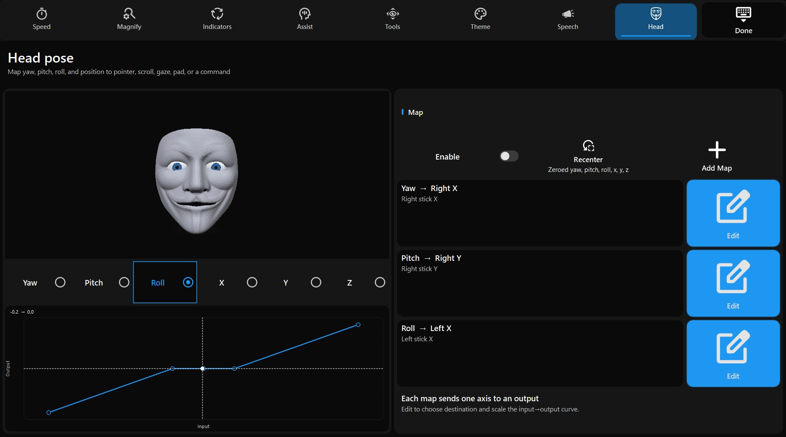

# Gazer {: .visually-hidden }

{ .wordmark }

Gaze-driven system input for Windows.

Gazer turns live gaze (Tobii Eye Tracker 5, or the mouse as a fallback) into on-screen pages you **dwell** to activate. Pages can type, click, move the pointer, speak, and run assist tools. The long-term aim is one stack for accessible gaming in place of OptiKey + OpenTrack + UCR + AutoHotkey.

[Install](install.md){ .md-button .md-button--primary }
[How dwell works](dwell.md){ .md-button }
[GitHub](https://github.com/AdamRoden/Gazer){ .md-button }

<video class="overlay-shot" controls playsinline muted loop autoplay preload="metadata" poster="assets/overlay.png" title="Startup splash tour of the dock">
  <source src="assets/splash.mp4" type="video/mp4">
</video>

The dock drawer sits on the desktop. Hide and Sleep hang in the bezel below the screen — dwell targets off the glass. Look at a cell until progress fills; that cell fires when you look away. A splash tour walks this on first launch (Assist → **Play tour** to replay).

{ .overlay-shot }

[Settings](settings.md) → **Head** maps yaw, pitch, roll, and position to pointer, scroll, a virtual pad, or a command.

Version **0.6.3**. License: [GPL-3.0](https://github.com/AdamRoden/Gazer/blob/master/LICENSE).

-   :material-eye-outline: __Dwell pages__

    One frameless overlay. Boards are XML grids and zones. Look at a cell until progress completes; the last dwell step repeats while gaze holds.

-   :material-dock-bottom: __Shell__

    Process-lifetime dock: **Main** (drawer), **Sleep** (pause dwell), Keyboard / Speak / Mouse / Gamepad / Assist / Settings, Close All, Quit.

-   :material-keyboard: __Keyboards__

    Compact and QWERTY boards. Cells type into Windows, or into the speech composer when that page is on top.

-   :material-mouse: __Mouse pad__

    Nudge, click, hold, scroll, dwell-move, click-at-gaze, ComboMouse.

-   :material-gamepad-variant: __Gamepad__

    Xbox-shaped board: face buttons, bumpers, triggers, d-pad, stick hats, look-to analog sticks.

-   :material-magnify: __Assist__

    Live magnifier, gaze reticle, gaze-follows-cursor, look-to-scroll, mag-pick zoom, foresight.

-   :material-microphone: __Speech__

    Gaze composer with an internal phrase, word chips, ElevenLabs or Windows SAPI, soundboard clips, and history.

-   :material-cog: __Settings__

    Gaze-operated boards for Speed, Magnify, Indicators, Assist, Tools, Theme, Speech, Head. No desktop dialogs for live prefs.

-   :material-pencil-ruler: __Page editor__

    Qt Widgets designer for the same XML the runtime loads. Saving a shipped page writes a user copy.

The overlay stays above the taskbar and other apps. The installed MSI can sit above Task Manager (`uiAccess`). Cells can also run AutoHotkey snippets or a local Python / AHK **file**.

## Start here

1. [Install](install.md) the MSI, or build from source.
2. Start Gazer. Dwell **Main** if the drawer is hidden.
3. Open Keyboard, Speak, Mouse, Gamepad, Assist, or Settings.
4. Read [How dwell works](dwell.md) if progress feels too fast or too slow.

To make your own boards, use the [page editor](editor.md) or [author Page XML](authoring.md).
